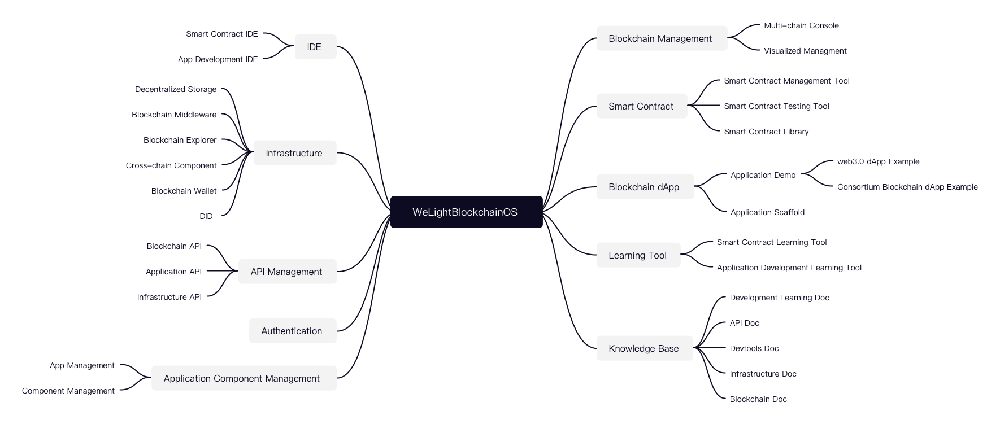
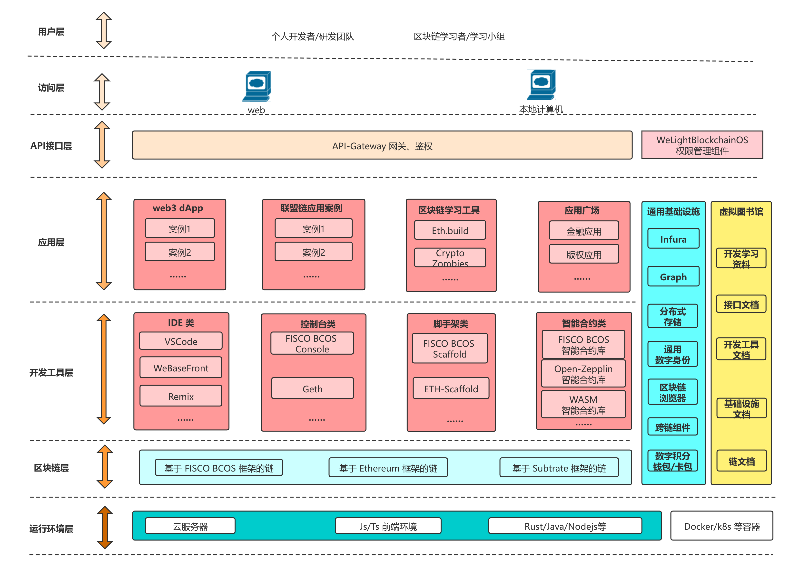

# WeLightBlockchainOS: cloud-based blockchain operating system

> [中文版文档](./README-zh.md)

Demo: http://os.doge.university

## Features and Architecture

Currently, blockchain development tools are many and complicated. Environment configuration is hard for beginners. For developers, we need a easy to use and out-of-the-box 「Blockchain Development Learning Toolkits」; for teams, we need a remote and shareable 「Blockchain Development Environment」; for blockchain ecosystem, we need a 「whole bucket」 of integrated development environment to attract more developers.



With this need, our team has developed this system. This system can be accessed from the browser in the cloud and is also a front-end simulation system, so it has low resource consumption. The system consists of several functional modules such as chain management, smart contract, blockchain application, learning toolset, knowledge base, IDE, infrastructure, interface management, permission control, application component management, etc.

We hope to finally achieve the purpose of helping developers and development teams to efficiently learn and master blockchain knowledge, build blockchain knowledge base, develop and maintain smart contracts and blockchain applications, and manage existing chain environments.



## Start project

Install dependencies

```
npm i
```

Start project

```
npm start
```

## Development introduction

### modify App

App's main body is `iframe`. We can have our App show different contents by modifying the `iframe`'s url. The url is stored at `src/apps.config.js`. If you want to change the content of the current music app, you can just do these modifications:

```
// src/apps.config.js

const urls = {
    appUrl: {
        - musicPlayer: '//music.163.com/outchain/player?type=4&id=959370203&auto=1&height=430',
        + musicPlayer: 'New url'
    ...
```


### "install" App

To "install" a new App, you need to add an App component to folder `apps`, and add App configuration and url in `apps.config.js`. Note that the component needs a `displaySomeApp` function.

```
// src/components/apps/someapp.js

import {urls} from '../../apps.config'

export default function SomeApp() {
    const someapp = urls.appUrl.someapp

    return (
        <iframe src={someapp}></iframe>
    )
}

export const displaySomeApp = () => {
    return <SomeApp></SomeApp>;
}
```

```
// src/apps.config.js

import { displaySomeApp } from './components/apps/someapp';

const apps = [
    {
        id: "someapp",
        title: "SomeApp",
        icon: './themes/Yaru/apps/someapp.png',
        disabled: false,
        favourite: true,
        desktop_shortcut: true,
        screen: displaySomeApp,
    },
    ...

const urls = {
    appUrl: {
        someapp: 'http://...',
        ...
```
